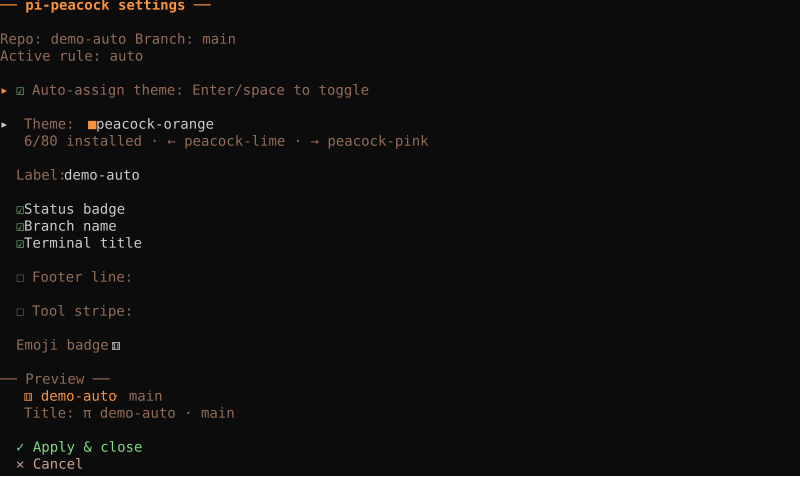
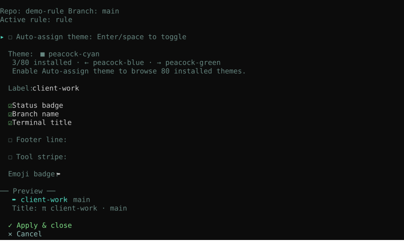
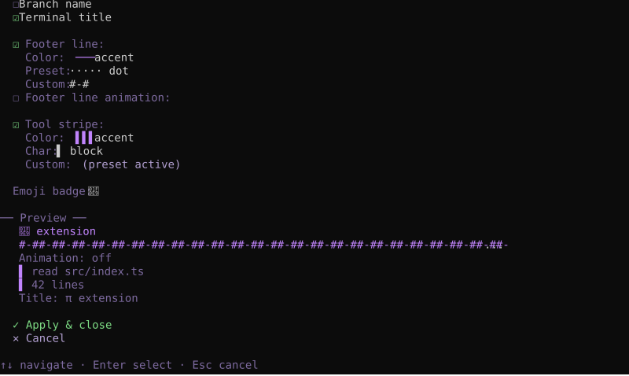
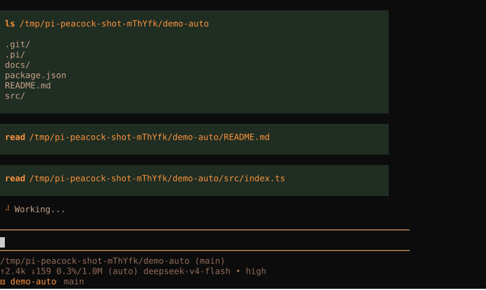
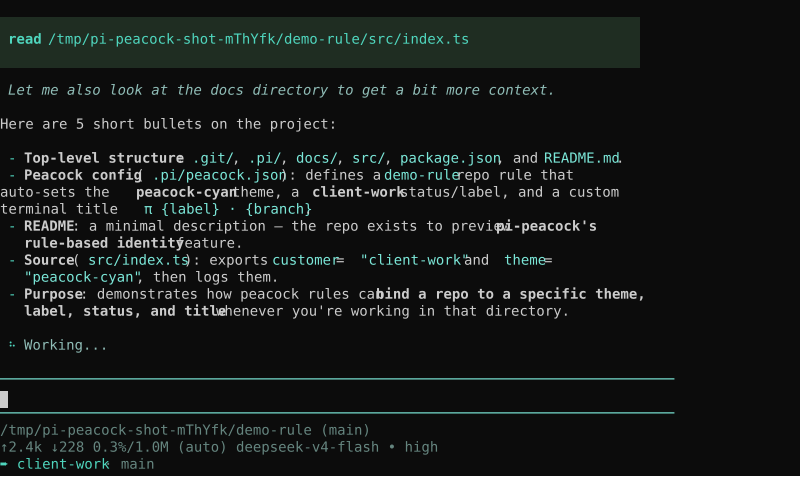
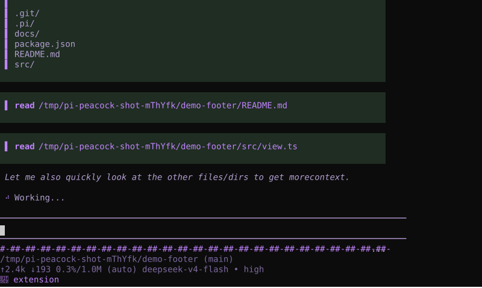

# pi-peacock

Peacock-style workspace coloring for [pi coding agent](https://pi.dev).

`pi-peacock` is for people who work in **multiple repos or multiple pi sessions** and want each workspace to be instantly recognizable, similar to the VS Code Peacock extension.

This repository started as a fork of the original [`metmirr/pi-peacock`](https://github.com/metmirr/pi-peacock) extension and has since grown into a more full-featured workspace identity tool with interactive controls, persistent runtime overrides, emoji support, and footer customization.

It gives pi a repo identity by:

- optionally switching to a repo-specific theme
- showing a colored repo badge in the footer
- setting the terminal title to the current repo and branch

So instead of every pi session looking the same, your backend repo can feel orange, your frontend blue, your extension purple, and so on.

## Screenshots

_All screenshots below are sanitized SVG terminal captures taken from temporary demo repos._

### Settings window

#### Auto-assigned workspace identity



_Auto-assign theme can give a repo its own color identity immediately, while still letting you inspect and tweak the active settings from `/peacock`._

#### Rule-based identity from config



_Project-local `.pi/peacock.json` can rename a repo, choose a fixed bundled theme, and make the rule-based identity visible directly in the settings panel._

#### Compact footer and tool-stripe customization



_Runtime overrides can produce a compact badge with a custom emoji, hidden branch name, patterned footer line, and colored tool stripe._

### Whole terminal demos

#### Auto-assigned identity during a tool-based run



_The active peacock theme carries through the whole terminal while pi is using tools, with the repo badge and title staying visible._

#### Rule-based identity during a tool-based run



_Rule-based repo naming and theming remain visible during a real run, including tool calls and the final response._

#### Compact footer demo during a tool-based run



_A compact footer style can keep the workspace identity obvious while taking less space in the terminal UI._

## What this package is for

If you regularly work across:

- multiple git repos
- a monorepo with several apps
- staging vs production workspaces
- client projects in separate terminals

then `pi-peacock` helps you distinguish them at a glance without relying on memory or terminal tab names alone.

It is especially useful when you often have several pi windows open at once.

## What it changes

`pi-peacock` changes **pi's own UI identity**, not your editor or terminal theme globally.

It can:

- apply a different **pi theme** per repo
- show a persistent **footer/status badge**
- set the **terminal title**

It does **not** try to recolor your terminal application's native window chrome, since that is terminal-dependent and not reliably portable.

## Features

- **optional automatic repo coloring** you can enable per repo from `/peacock`
- **stable theme assignment** by hashing the git repo name when auto-assign is enabled
- **accent-striped tool blocks** — every built-in tool (read, bash, edit, write, grep, find, ls) can show a colored accent stripe, fully customizable: toggle on/off, choose color from theme palette, choose the side (`left`, `right`, or `both`), pick a preset character, or type a custom one. The stripe color matches the active peacock theme by default, giving each project a distinctive look at a glance
- **bundled peacock themes** ready to use out of the box, plus repo-level switching to any theme installed in pi
- **per-repo overrides** via `peacock.json`
- **project + global config** support
- **interactive settings panel** via `/peacock`
- **runtime overrides that persist per repo** across sessions
- **first-run random emoji badge** for repos without saved settings
- **emoji picker** for the footer badge
- **footer line customization** with color and pattern controls
- **active-only footer line animation** while the agent is working
- **status, branch, and title toggles** from commands or TUI
- **publishable pi package** for npm/git installs

## Included themes

- `peacock-amber`
- `peacock-blue`
- `peacock-cyan`
- `peacock-green`
- `peacock-lime`
- `peacock-orange`
- `peacock-pink`
- `peacock-purple`
- `peacock-red`
- `peacock-rose`
- `peacock-sky`
- `peacock-teal`

These themes are tuned for dark terminals and make border/accent differences obvious without being overly noisy.

## Install

### From git (recommended)

```bash
pi install git:github.com/UtImpetus/pi-peacock
```

Or via HTTPS shorthand:

```bash
pi install https://github.com/UtImpetus/pi-peacock
```

### From a local checkout

```bash
git clone https://github.com/UtImpetus/pi-peacock
pi install ./pi-peacock
```

### Try without installing

```bash
pi -e git:github.com/UtImpetus/pi-peacock
```

Or from a local checkout:

```bash
pi -e ./pi-peacock
```

### From npm (original version)

```bash
pi install npm:pi-peacock
```

## Quick start

You can use `pi-peacock` with **no config at all**.

Once installed, it will:

1. detect the current git repo
2. keep your current pi theme unchanged by default
3. assign a random emoji badge the first time a repo is seen
4. show repo + branch information in pi's UI
5. let you enable per-repo auto theme assignment from `/peacock`

If you want fixed mappings, add a config file.

## Fork notes

Compared to the original [`metmirr/pi-peacock`](https://github.com/metmirr/pi-peacock) extension, this fork adds a broader runtime control layer on top of the core peacock idea.

It includes:

- a full-screen TUI settings panel
- direct subcommands for theme, label, toggles, emoji, reset, and status
- persistent per-repo runtime settings stored outside config files
- configurable footer separator lines
- richer badge customization for multi-repo workflows

## Configuration

`pi-peacock` looks for config in:

- `~/.pi/agent/peacock.json`
- `<git-root>/.pi/peacock.json`

Project config overrides global config.

By default, `pi-peacock` preserves your current pi theme. If you want repo-specific theme switching, enable **Auto-assign theme** in `/peacock` or set `autoAssignTheme: true` in config.

## Minimal config

```json
{
  "rules": [
    { "repo": "nearbygpt-backend", "theme": "peacock-amber", "label": "backend" },
    { "repo": "nearbygpt-pwa", "theme": "peacock-blue", "label": "pwa" },
    { "repo": "chrome-extension", "theme": "peacock-purple", "label": "extension" },
    { "repo": "mapsense-app", "theme": "peacock-green", "label": "mapsense" }
  ]
}
```

## Full config

```json
{
  "autoAssignTheme": false,
  "fallbackTheme": "dark",
  "fallbackLabel": "workspace",
  "showBranch": true,
  "showStatus": true,
  "showTitle": true,
  "titlePrefix": "π",
  "footerLine": true,
  "footerLineColor": "accent",
  "footerLinePattern": "┄",
  "footerLineAnimate": true,
  "footerLineAnimationMs": 320,
  "toolStripe": true,
  "toolStripeColor": "accent",
  "toolStripeChar": "▌",
  "toolStripeSide": "both",
  "rules": [
    {
      "repo": "nearbygpt-backend",
      "theme": "peacock-amber",
      "label": "backend",
      "title": "π {label} · {branch}",
      "status": "backend",
      "footerLine": true,
      "footerLineColor": "warning",
      "footerLineWidth": 5,
      "toolStripe": true,
      "toolStripeSide": "right"
    },
    {
      "pathIncludes": ["/work/client-a/", "/work/client-b/"],
      "theme": "peacock-cyan",
      "label": "client-work"
    }
  ]
}
```

## Rule fields

Each rule can contain:

- `repo`: exact git repo folder name
- `pathIncludes`: string or array of substrings matched against `cwd` and git root
- `theme`: theme name to switch to
- `label`: short name used for footer/title
- `title`: custom title template
- `status`: custom footer label/template
- `footerLine`: enable or disable the footer line for that matched repo
- `footerLineColor`: footer-line color token from the active theme palette
- `footerLinePattern`: repeated footer-line pattern
- `footerLineWidth`: legacy preset width selector for the footer line
- `footerLineAnimate`: enable or disable footer-line animation for that matched repo
- `footerLineAnimationMs`: footer-line animation step interval in milliseconds
- `toolStripe`: enable or disable tool stripes for that matched repo
- `toolStripeColor`: stripe color token from the active theme palette
- `toolStripeChar`: stripe character/pattern
- `toolStripeSide`: `left`, `right`, or `both`

Top-level config can also set `footerLine`, `footerLineColor`, `footerLinePattern`, `footerLineWidth`, `footerLineAnimate`, `footerLineAnimationMs`, `toolStripe`, `toolStripeColor`, `toolStripeChar`, and `toolStripeSide` as defaults for the current repo. Runtime changes made in `/peacock` still override file-based settings.

Animation-related config:

- `footerLineAnimate`: enable or disable footer-line animation while the agent is active
- `footerLineAnimationMs`: animation step interval in milliseconds

Available placeholders in `title` and `status`:

- `{repo}`
- `{branch}`
- `{label}`
- `{cwd}`
- `{gitRoot}`

## Command

### `/peacock`

Opens the interactive settings panel by default and can also be used with subcommands.

Inside the settings panel, the installed-theme picker is disabled until you turn on **Auto-assign theme**.

Available subcommands:

- `/peacock theme <name>` — requires **Auto-assign theme** to be enabled and accepts any installed pi theme name
- `/peacock auto-theme <on|off>`
- `/peacock label <text>`
- `/peacock toggle <status|branch|title>`
- `/peacock emoji`
- `/peacock reset`
- `/peacock status`

Useful when:

- you changed config and want to refresh
- you enabled auto-assign or a theme override and want pi-peacock to take over again
- you want to verify which rule matched
- you want to adjust repo identity without editing config files

## NearbyGPT example

An example config for this monorepo is included at:

- `examples/nearbygpt-peacock.json`

## Package structure

This package ships with:

- `extensions/repo-peacock.ts` — the pi extension
- `themes/*.json` — bundled peacock themes
- `examples/nearbygpt-peacock.json` — sample repo mapping config

## Publish

### Publish to npm

```bash
npm publish
```

### Publish as a pi package on GitHub

After pushing the repo to GitHub, users can install it directly with:

```bash
pi install git:github.com/UtImpetus/pi-peacock
```

The package already includes the `pi-package` keyword so it is ready to be distributed as a pi package.

## Notes

- If no rule matches, `pi-peacock` keeps your current pi theme unless auto-assign is enabled.
- If a repo has no persisted settings yet, `pi-peacock` assigns a random emoji once and then keeps it for that repo.
- Tool block accent stripes are off by default. Enable them from `/peacock` → **Tool stripe**. Once enabled, they use the theme's `accent` color by default. You can customize the color, choose whether the stripe renders on the `left`, `right`, or `both` sides of tool blocks, pick from preset stripe characters (block, solid, bar, thin, dot, dash, double, arrow, diamond, star, pound), or type a custom character. Settings persist per repo.
- If you switch git branches during a session, the footer/title updates after the current turn.
- If auto-assign or a theme override is active and you manually change theme in pi, `pi-peacock` will re-apply when identity changes or when you run `/peacock`.
